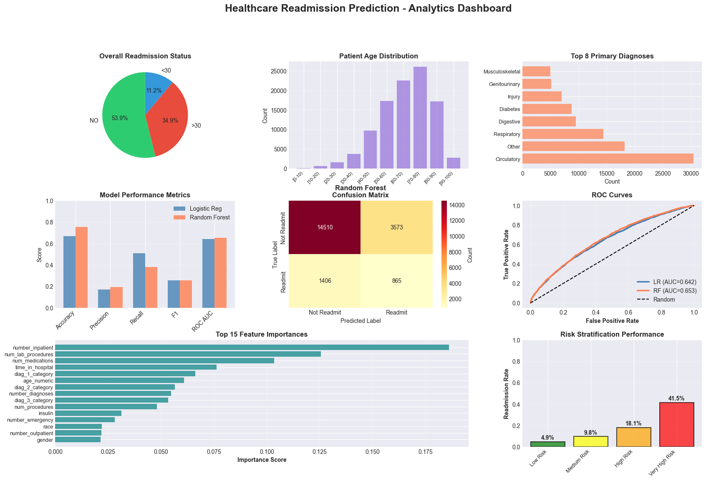

#  Healthcare Readmission Prediction



---

## Project Overview
End-to-end ML pipeline for predicting 30-day hospital readmissions.


##  Requirements

To run this project locally, ensure the following dependencies and tools are installed:

###  Programming Language
- Python 

###  Core Libraries
- pandas
- numpy
- scikit-learn
- matplotlib
- seaborn
- xgboost
- imbalanced-learn

###  Development Environment
- Jupyter Notebook / VS Code
- Git
- GitHub

###  Optional (for Model Deployment)
- Flask / FastAPI
- Streamlit (for dashboard deployment)

---

##  Installation

Clone the repository:

```bash

https://github.com/Anuj-codes21/healthcare-readmission-prediction/edit/main/README.md


pip install -r requirements.txt

---

```markdown
This project was developed using a structured Machine Learning workflow including data preprocessing, feature engineering, model building, evaluation, and visualization.

